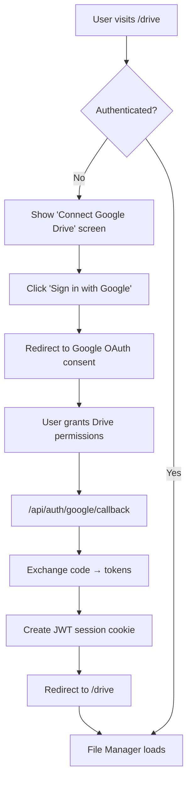
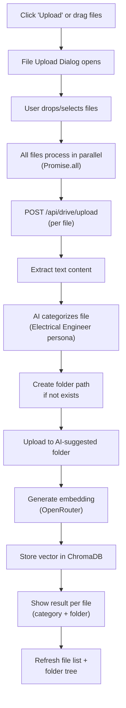
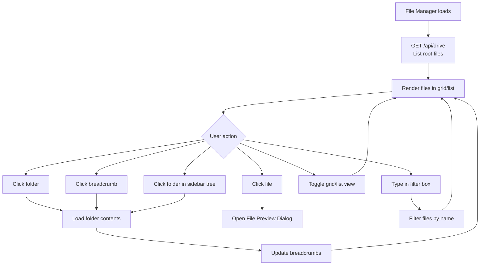
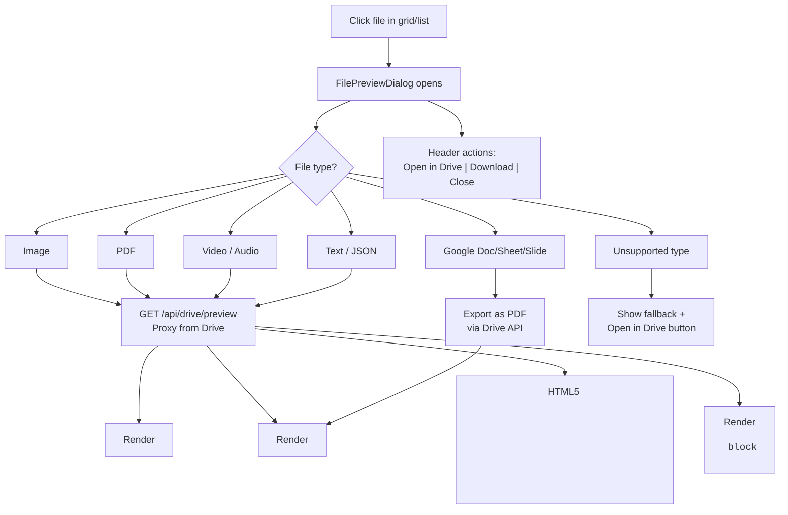
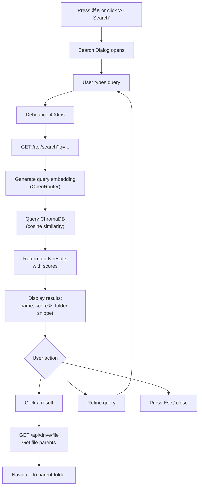
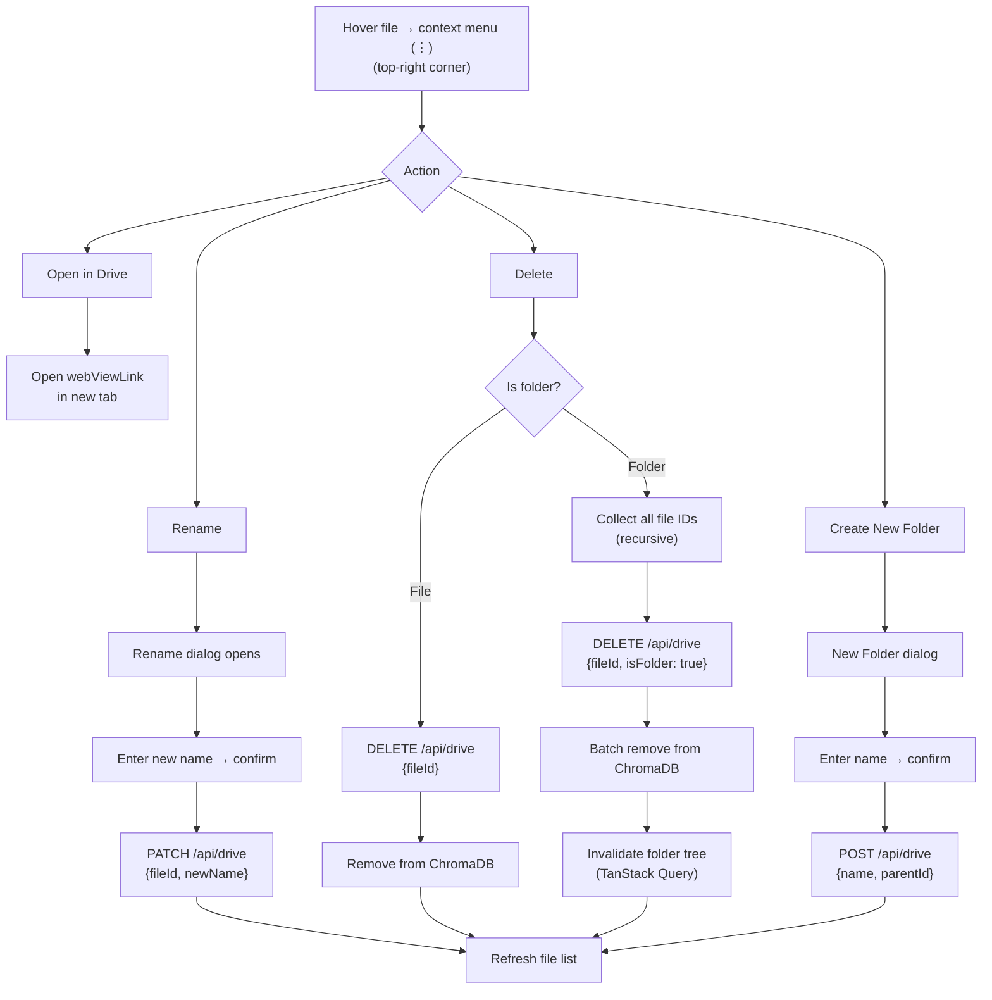
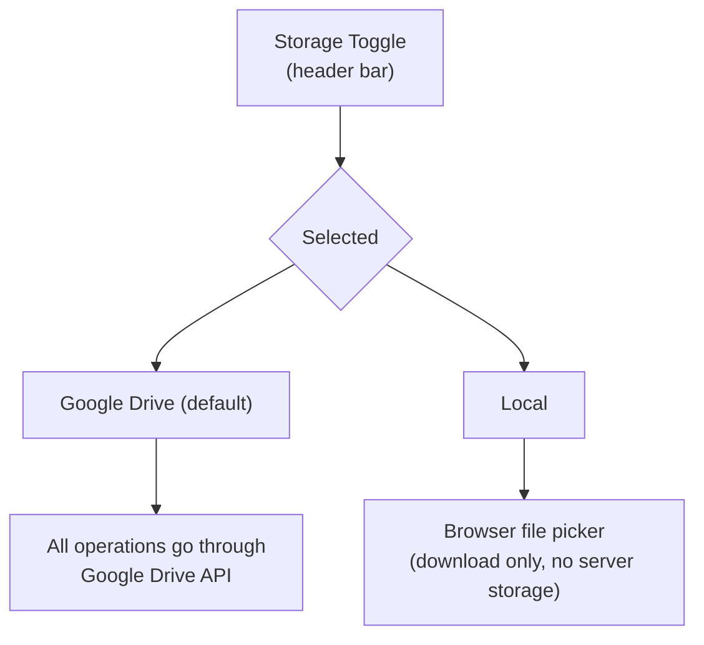
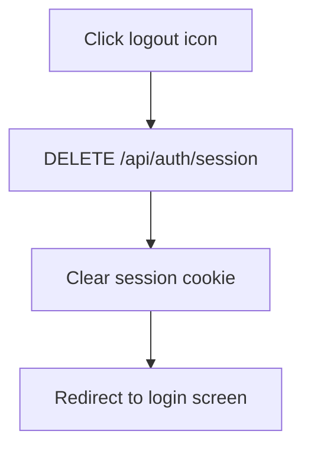
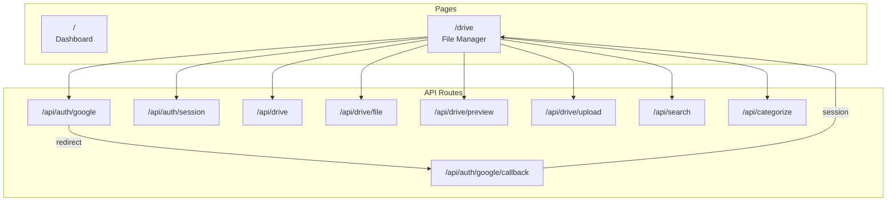

# KM-CRM — User Flows

## 1. Authentication Flow

---

## 2. File Upload Flow (Parallel)

> **Note:** AI categorization always runs regardless of current folder. The `folderId` is never sent from the frontend.

---

## 3. File Browsing Flow

---

## 4. File Preview Flow

> **Note:** Non-ASCII filenames (Thai) use RFC 5987 encoding in `Content-Disposition` headers.

---

## 5. AI Semantic Search Flow

---

## 6. File Management Flow

---

## 7. Storage Toggle Flow

---

## 8. Logout Flow

---

## Page Map

